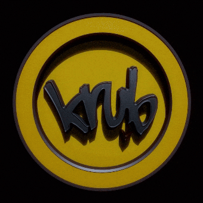
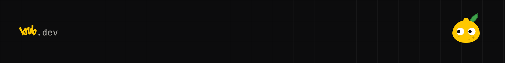

<h1 align="center">
  
</h1>

  <a href="https://krub.dev">krub.dev</a> &nbsp;·&nbsp;
  <a href="https://linkedin.com/in/krub">LinkedIn</a> &nbsp;·&nbsp;
  <a href="mailto:contact@krub.dev">contact@krub.dev</a> &nbsp;·&nbsp;
  <a href="https://krub.dev/uploads/cv-en.pdf">CV</a>

Full Stack Developer | Backend Focus | Java · Spring Boot · PostgreSQL · Vue.js · Node.js | CS @42Barcelona

- **Currently** building [krub.dev](https://krub.dev) and studying the **FP DAW** higher vocational
  qualification (Web Application Development).
- **Looking to collaborate** on open source and personal projects.
- **Ask me about** tech, 3D workflows and art, printing, TV series, animation and cinema.
- **Fun fact**: testing with "Acho" and "24" 🍋

<strong>Stack</strong>

**Languages**

**Backend & data**

**Frontend & design**

 

**Tools & AI**

  <picture><source media="(prefers-color-scheme: dark)" srcset="./assets/icons/opencode-white.svg"></picture>

<strong>Projects</strong>

- **[CreandoMientras](https://creandomientras.com)**: site and self-managed panel for a handmade
  macramé business, with no subscription: Vue 3 on a Git-based CMS. `2025`
- **[sideForge](https://github.com/krub-dev/sideForge)**: Java and Spring Boot REST API to manage
  and customise 3D assets for the web. `2025`
- **[Showroom](https://showroom-fullstack-m3-production.up.railway.app/)**: full stack app to manage
  and show projects: full CRUD, search and an admin panel. `2025`
- **[krub.dev](https://github.com/krub-dev/portfolio-krub)**: a Vue 3 SPA with a design system of its
  own, tested end to end. `2026`

<strong>42 Barcelona · Progress</strong>

&nbsp;

| Milestone | Project | Score |
|:--:|---|--:|
| 0 | Libft | 125 |
| 1 | Printf | 100 |
| 1 | Born2beroot | 100 |
| 1 | get_next_line | 125 |
| 2 | push_swap | 84 |
| 2 | Minitalk | 125 |
| 2 | so_long | 110 |
| 3 | Philosophers | 100 |
| 3 | Minishell | 100 |
| 3 | Exam Rank 03 | 100 |
| ⚫ | Black hole | -42 |

Full profile on the 42 intra: [frubio-i](https://profile.intra.42.fr/users/frubio-i).

<strong>Stats</strong>

&nbsp;

  

  

&nbsp;

  

